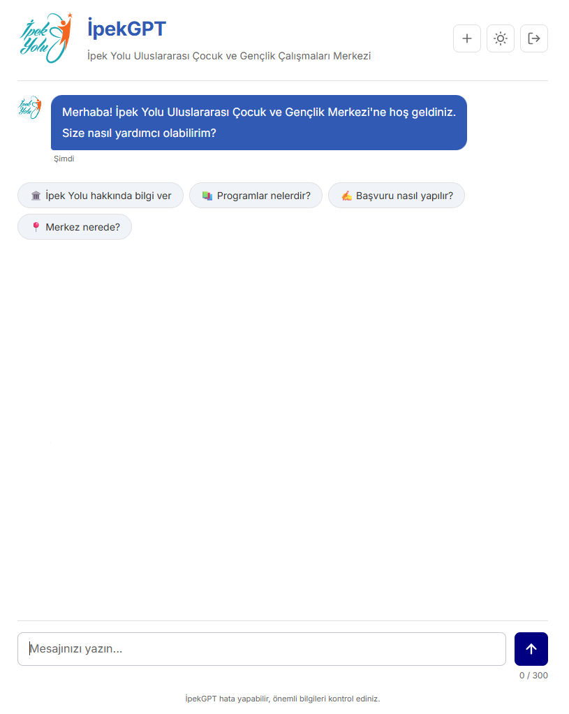
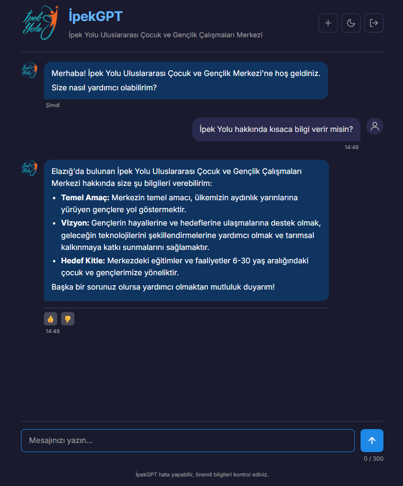

# IpekGPT

RAG-powered AI assistant for the **İpek Yolu Uluslararası Çocuk ve Gençlik Çalışmaları Merkezi**.  
Built with FastAPI + ChromaDB + Google Gemini to answer questions about the organization with a clean, lightweight web UI.

**Languages:** English (default) | Türkçe

---

## English

### Overview
IpekGPT is a Retrieval-Augmented Generation (RAG) assistant that serves organization-specific answers based on a curated knowledge base. It includes a FastAPI backend, a static web frontend, and a persistent ChromaDB vector store.

### Key Features
- **RAG pipeline** with ChromaDB for grounded answers
- **Conversation memory** (last 6 messages) for follow-up context
- **Request queue + rate limiting** to stabilize throughput
- **Feedback capture** (thumbs up/down)
- **Modern single-page UI** (HTML/CSS/JS)
- **Bilingual responses** (answers in the user’s language)

### Screenshots



### Tech Stack
- **Backend:** FastAPI
- **LLM:** Google Gemini (configurable)
- **Vector DB:** ChromaDB
- **Database:** SQLite (SQLAlchemy)
- **Frontend:** Vanilla HTML/CSS/JavaScript

### Project Structure
```
ipekgpt/
├── app/                      # FastAPI application
│   ├── main.py               # API entry point
│   ├── config.py             # Configuration
│   ├── database.py           # SQLite models & helpers
│   ├── rag_engine.py         # RAG + Gemini integration
│   ├── request_queue.py      # FIFO request queue
│   ├── rate_limiter.py       # Daily rate limiting
│   └── static/               # Frontend assets
├── chroma_db/                # Persistent ChromaDB store
├── data/                     # Legacy JSON data (old format)
├── IPEKYOLU_RAG_VERISETI/     # New-format JSON data
├── rebuild_chromadb.py       # Rebuild script (Colab)
├── ipekgpt.db                # SQLite database
└── requirements.txt
```

### Setup
1. **Create and activate a virtual environment**
2. **Install dependencies**
   ```bash
   pip install -r requirements.txt
   ```
3. **Create a `.env` file**
   ```bash
   GEMINI_API_KEYS=key1,key2
   GEMINI_MODEL=gemini-3-flash-preview
   ```
   - `GEMINI_API_KEYS` is required (comma-separated).
   - `GEMINI_MODEL` is optional; defaults to the value in `app/config.py`.

4. **Run the server**
   ```bash
   python -m uvicorn app.main:app --reload --host 127.0.0.1 --port 8000
   ```
5. Open `http://127.0.0.1:8000`

### API Endpoints (Core)
- `GET /` – Web UI
- `POST /api/session` – Create session
- `POST /ipekgpt/chat` – Chat endpoint
- `POST /api/feedback` – Submit feedback
- `GET /api/rate-limit` – Rate limit status
- `GET /health` – Health check

### Data & Knowledge Base
The app **loads an existing ChromaDB store** from `chroma_db/`.  
If you update JSON data sources, rebuild the vector database using `rebuild_chromadb.py` (intended for Google Colab), then replace the `chroma_db/` folder.

### Configuration Notes
- **Daily request limit** defaults to `300` (see `app/config.py`).
- CORS origins and server host/port are configurable.

---

## Türkçe

### Genel Bakış
İpekGPT, **İpek Yolu Uluslararası Çocuk ve Gençlik Çalışmaları Merkezi** için geliştirilmiş bir RAG (Retrieval-Augmented Generation) tabanlı yapay zeka asistanıdır. FastAPI backend, statik web arayüzü ve kalıcı ChromaDB vektör veritabanı kullanır.

### Öne Çıkan Özellikler
- **RAG altyapısı** (ChromaDB ile bilgi tabanı temelli yanıtlar)
- **Konuşma hafızası** (son 6 mesaj)
- **İstek kuyruğu + rate limit**
- **Geri bildirim sistemi** (👍/👎)
- **Modern, sade web arayüzü**
- **Kullanıcı dilinde yanıt** (TR/EN vb.)

### Ekran Görüntüleri


### Teknoloji Yığını
- **Backend:** FastAPI
- **LLM:** Google Gemini (ayarlanabilir)
- **Vector DB:** ChromaDB
- **Database:** SQLite (SQLAlchemy)
- **Frontend:** Vanilla HTML/CSS/JavaScript

### Kurulum
1. **Sanal ortam oluşturun ve aktif edin**
2. **Bağımlılıkları yükleyin**
   ```bash
   pip install -r requirements.txt
   ```
3. **`.env` dosyası oluşturun**
   ```bash
   GEMINI_API_KEYS=key1,key2
   GEMINI_MODEL=gemini-3-flash-preview
   ```
   - `GEMINI_API_KEYS` zorunludur (virgülle ayrılmış).
   - `GEMINI_MODEL` opsiyoneldir; `app/config.py` içindeki varsayılan kullanılır.

4. **Sunucuyu başlatın**
   ```bash
   python -m uvicorn app.main:app --reload --host 127.0.0.1 --port 8000
   ```
5. Tarayıcıdan `http://127.0.0.1:8000` adresine gidin.

### Veri ve Bilgi Tabanı
Uygulama, `chroma_db/` içindeki **mevcut** vektör veritabanını yükler.  
JSON veri kaynaklarını güncellediğinizde `rebuild_chromadb.py` (Colab için) ile yeni veritabanı üretip `chroma_db/` klasörünü güncelleyin.

### Konfigürasyon Notları
- **Günlük istek limiti** varsayılan olarak `300` (bkz. `app/config.py`).
- CORS, host ve port ayarları konfigürasyondan değiştirilebilir.
